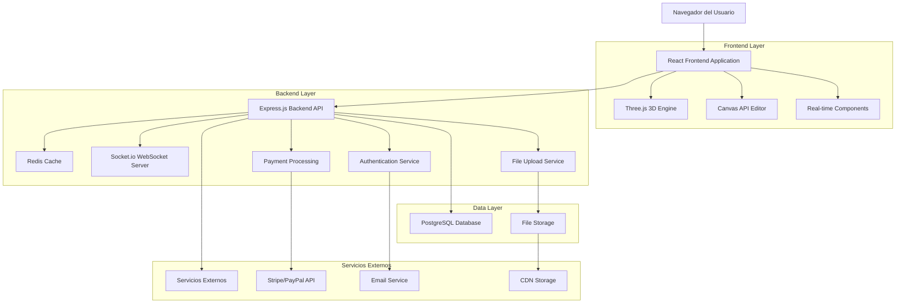
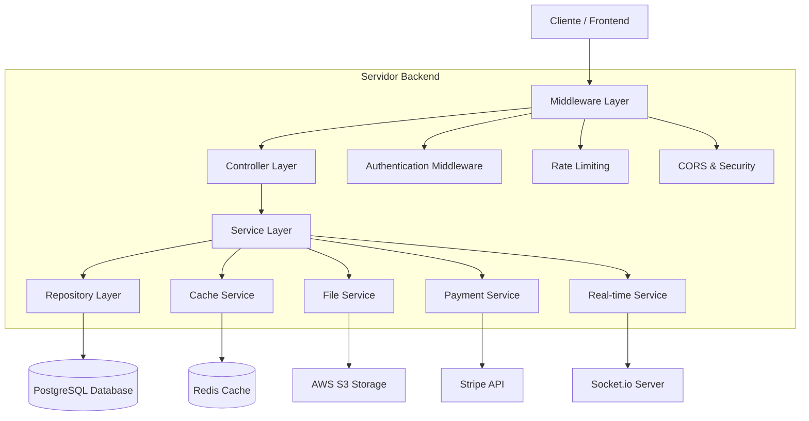
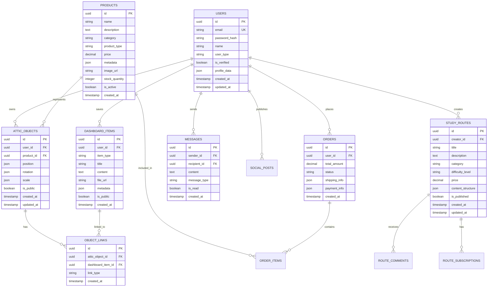

# Documento de Arquitectura Técnica - Desván Digital

## 1. Diseño de Arquitectura



## 2. Descripción de Tecnologías

* **Frontend**: React\@18 + TypeScript + Vite + TailwindCSS\@3 + Three.js\@0.158 + Socket.io-client + Fabric.js + React Query

* **Backend**: Node.js\@18 + Express\@4 + TypeScript + Socket.io + Multer + JWT + Bcrypt + Helmet + CORS

* **Base de Datos**: PostgreSQL\@15 + Redis\@7 (cache y sesiones)

* **Autenticación**: JWT + Refresh Tokens + OAuth2 (Google, Facebook)

* **Almacenamiento**: AWS S3 / Cloudinary para archivos multimedia

* **Pagos**: Stripe API para procesamiento de pagos

* **Tiempo Real**: Socket.io para chat y notificaciones

## 3. Definiciones de Rutas

| Ruta                    | Propósito                                               |
| ----------------------- | ------------------------------------------------------- |
| /                       | Página de inicio con hero section y contenido destacado |
| /login                  | Página de autenticación de usuarios                     |
| /register               | Página de registro de nuevos usuarios                   |
| /dashboard              | Panel de control personal del usuario                   |
| /store                  | Tienda de productos físicos y virtuales                 |
| /store/product/:id      | Página de detalle de producto individual                |
| /cart                   | Carrito de compras y proceso de checkout                |
| /social                 | Feed principal de la red social                         |
| /social/profile/:userId | Perfil público de usuario                               |
| /study-routes           | Explorador de rutas de estudio                          |
| /study-routes/:routeId  | Detalle de ruta de estudio específica                   |
| /dashboard-board        | Pizarra personal del usuario                            |
| /attic                  | Desván 3D interactivo del usuario                       |
| /attic/:userId          | Desván público de otro usuario (si es público)          |
| /design                 | Editor de canvas para diseño personalizado              |
| /messages               | Sistema de mensajería interna                           |
| /admin                  | Panel de administración (solo admins)                   |
| /admin/users            | Gestión de usuarios                                     |
| /admin/content          | Moderación de contenido                                 |
| /admin/analytics        | Métricas y análisis de la plataforma                    |

## 4. Definiciones de API

### 4.1 API Principal

**Autenticación de usuarios**

```
POST /api/auth/register
```

Request:

| Nombre Parámetro | Tipo Parámetro | Requerido | Descripción                               |
| ---------------- | -------------- | --------- | ----------------------------------------- |
| email            | string         | true      | Email del usuario                         |
| password         | string         | true      | Contraseña (mínimo 8 caracteres)          |
| name             | string         | true      | Nombre completo del usuario               |
| userType         | string         | false     | Tipo de usuario (regular, creator, brand) |

Response:

| Nombre Parámetro | Tipo Parámetro | Descripción               |
| ---------------- | -------------- | ------------------------- |
| success          | boolean        | Estado de la respuesta    |
| token            | string         | JWT token de acceso       |
| refreshToken     | string         | Token para renovar sesión |
| user             | object         | Datos del usuario creado  |

**Gestión de productos**

```
GET /api/products
```

Request:

| Nombre Parámetro | Tipo Parámetro | Requerido | Descripción                               |
| ---------------- | -------------- | --------- | ----------------------------------------- |
| category         | string         | false     | Filtrar por categoría (physical, virtual) |
| page             | number         | false     | Número de página para paginación          |
| limit            | number         | false     | Cantidad de productos por página          |
| search           | string         | false     | Término de búsqueda                       |

Response:

| Nombre Parámetro | Tipo Parámetro | Descripción                  |
| ---------------- | -------------- | ---------------------------- |
| products         | array          | Lista de productos           |
| totalPages       | number         | Total de páginas disponibles |
| currentPage      | number         | Página actual                |

**Gestión del desván 3D**

```
POST /api/attic/objects
```

Request:

| Nombre Parámetro | Tipo Parámetro | Requerido | Descripción                             |
| ---------------- | -------------- | --------- | --------------------------------------- |
| objectId         | string         | true      | ID del objeto virtual                   |
| position         | object         | true      | Coordenadas x, y, z en el espacio 3D    |
| rotation         | object         | false     | Rotación del objeto                     |
| linkedContent    | string         | false     | ID del contenido enlazado de la pizarra |

Response:

| Nombre Parámetro | Tipo Parámetro | Descripción               |
| ---------------- | -------------- | ------------------------- |
| success          | boolean        | Estado de la operación    |
| atticObject      | object         | Datos del objeto colocado |

**Sistema de mensajería en tiempo real**

```
POST /api/messages
```

Request:

| Nombre Parámetro | Tipo Parámetro | Requerido | Descripción                         |
| ---------------- | -------------- | --------- | ----------------------------------- |
| recipientId      | string         | true      | ID del usuario destinatario         |
| content          | string         | true      | Contenido del mensaje               |
| messageType      | string         | false     | Tipo de mensaje (text, image, link) |

Response:

| Nombre Parámetro | Tipo Parámetro | Descripción               |
| ---------------- | -------------- | ------------------------- |
| success          | boolean        | Estado del envío          |
| message          | object         | Datos del mensaje enviado |

Ejemplo de Request:

```json
{
  "email": "usuario@ejemplo.com",
  "password": "contraseña123",
  "name": "Juan Pérez",
  "userType": "regular"
}
```

## 5. Diagrama de Arquitectura del Servidor



## 6. Modelo de Datos

### 6.1 Definición del Modelo de Datos



### 6.2 Lenguaje de Definición de Datos

**Tabla de Usuarios (users)**

```sql
-- Crear tabla de usuarios
CREATE TABLE users (
    id UUID PRIMARY KEY DEFAULT gen_random_uuid(),
    email VARCHAR(255) UNIQUE NOT NULL,
    password_hash VARCHAR(255) NOT NULL,
    name VARCHAR(100) NOT NULL,
    user_type VARCHAR(20) DEFAULT 'regular' CHECK (user_type IN ('regular', 'creator', 'brand', 'admin')),
    is_verified BOOLEAN DEFAULT false,
    profile_data JSONB DEFAULT '{}',
    created_at TIMESTAMP WITH TIME ZONE DEFAULT NOW(),
    updated_at TIMESTAMP WITH TIME ZONE DEFAULT NOW()
);

-- Crear índices
CREATE INDEX idx_users_email ON users(email);
CREATE INDEX idx_users_user_type ON users(user_type);
CREATE INDEX idx_users_created_at ON users(created_at DESC);
```

**Tabla de Rutas de Estudio (study\_routes)**

```sql
-- Crear tabla de rutas de estudio
CREATE TABLE study_routes (
    id UUID PRIMARY KEY DEFAULT gen_random_uuid(),
    creator_id UUID NOT NULL REFERENCES users(id) ON DELETE CASCADE,
    title VARCHAR(200) NOT NULL,
    description TEXT,
    category VARCHAR(50) NOT NULL,
    difficulty_level VARCHAR(20) CHECK (difficulty_level IN ('beginner', 'intermediate', 'advanced')),
    price DECIMAL(10,2) DEFAULT 0.00,
    content_structure JSONB DEFAULT '{}',
    is_published BOOLEAN DEFAULT false,
    created_at TIMESTAMP WITH TIME ZONE DEFAULT NOW(),
    updated_at TIMESTAMP WITH TIME ZONE DEFAULT NOW()
);

-- Crear índices
CREATE INDEX idx_study_routes_creator_id ON study_routes(creator_id);
CREATE INDEX idx_study_routes_category ON study_routes(category);
CREATE INDEX idx_study_routes_published ON study_routes(is_published);
```

**Tabla de Productos (products)**

```sql
-- Crear tabla de productos
CREATE TABLE products (
    id UUID PRIMARY KEY DEFAULT gen_random_uuid(),
    name VARCHAR(200) NOT NULL,
    description TEXT,
    category VARCHAR(50) NOT NULL,
    product_type VARCHAR(20) CHECK (product_type IN ('physical', 'virtual')),
    price DECIMAL(10,2) NOT NULL,
    metadata JSONB DEFAULT '{}',
    image_url VARCHAR(500),
    stock_quantity INTEGER DEFAULT 0,
    is_active BOOLEAN DEFAULT true,
    created_at TIMESTAMP WITH TIME ZONE DEFAULT NOW()
);

-- Crear índices
CREATE INDEX idx_products_category ON products(category);
CREATE INDEX idx_products_type ON products(product_type);
CREATE INDEX idx_products_active ON products(is_active);
```

**Tabla de Objetos del Desván (attic\_objects)**

```sql
-- Crear tabla de objetos del desván
CREATE TABLE attic_objects (
    id UUID PRIMARY KEY DEFAULT gen_random_uuid(),
    user_id UUID NOT NULL REFERENCES users(id) ON DELETE CASCADE,
    product_id UUID NOT NULL REFERENCES products(id),
    position JSONB NOT NULL DEFAULT '{"x": 0, "y": 0, "z": 0}',
    rotation JSONB DEFAULT '{"x": 0, "y": 0, "z": 0}',
    scale JSONB DEFAULT '{"x": 1, "y": 1, "z": 1}',
    is_public BOOLEAN DEFAULT false,
    created_at TIMESTAMP WITH TIME ZONE DEFAULT NOW(),
    updated_at TIMESTAMP WITH TIME ZONE DEFAULT NOW()
);

-- Crear índices
CREATE INDEX idx_attic_objects_user_id ON attic_objects(user_id);
CREATE INDEX idx_attic_objects_product_id ON attic_objects(product_id);
CREATE INDEX idx_attic_objects_public ON attic_objects(is_public);
```

**Datos iniciales**

```sql
-- Insertar usuario administrador
INSERT INTO users (email, password_hash, name, user_type, is_verified)
VALUES ('admin@desvandigital.com', '$2b$10$hashedpassword', 'Administrador', 'admin', true);

-- Insertar productos virtuales básicos
INSERT INTO products (name, description, category, product_type, price, metadata)
VALUES 
('Escritorio Virtual', 'Escritorio clásico para organizar documentos', 'furniture', 'virtual', 0.00, '{"model": "desk_basic.glb"}'),
('Estantería Virtual', 'Estantería para libros y objetos de estudio', 'furniture', 'virtual', 5.99, '{"model": "bookshelf.glb"}'),
('Lámpara de Estudio', 'Iluminación para el área de trabajo', 'lighting', 'virtual', 2.99, '{"model": "desk_lamp.glb"}');

-- Insertar categorías de rutas de estudio
INSERT INTO study_routes (creator_id, title, description, category, difficulty_level, is_published)
SELECT 
    u.id,
    'Introducción a la Memorización',
    'Técnicas básicas del palacio de memoria',
    'memory_techniques',
    'beginner',
    true
FROM users u WHERE u.user_type = 'admin' LIMIT 1;
```

