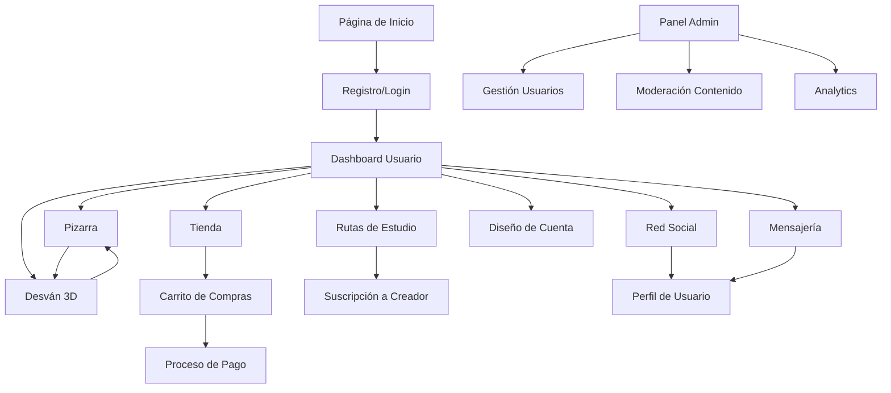

# Documento de Requisitos del Producto - Desván Digital

## 1. Descripción General del Producto

Desván Digital es una plataforma web integral que combina comercio electrónico, red social, sistema de aprendizaje y memorización 3D. La plataforma utiliza el concepto del "desván de Sherlock Holmes" donde los usuarios pueden asociar objetos virtuales en un espacio 3D con información de estudio para mejorar la memorización y el aprendizaje.

- Resuelve el problema de la dispersión de información de estudio y la dificultad para memorizar contenido complejo mediante técnicas de palacio de memoria.
- Dirigido a estudiantes, profesionales, creadores de contenido educativo y marcas que buscan promocionar herramientas educativas.
- Valor de mercado: Plataforma educativa innovadora que combina e-commerce, redes sociales y técnicas de memorización avanzadas.

## 2. Características Principales

### 2.1 Roles de Usuario

| Rol | Método de Registro | Permisos Principales |
|-----|-------------------|---------------------|
| Usuario Regular | Registro por email | Acceso a todas las funciones básicas, crear desván privado, comprar productos |
| Creador de Contenido | Upgrade mediante verificación | Crear rutas de estudio, recibir suscripciones, monetizar contenido |
| Marca Asociada | Invitación y aprobación | Promocionar herramientas, patrocinar creadores, acceso a analytics |
| Administrador | Acceso interno | Control total del sistema, moderación, gestión de usuarios y contenido |

### 2.2 Módulos de Funcionalidad

Nuestros requisitos del Desván Digital consisten en las siguientes páginas principales:

1. **Página de Inicio**: sección hero, navegación principal, feed destacado, estadísticas de la plataforma.
2. **Tienda**: catálogo de productos físicos y virtuales, carrito de compras, sistema de pagos, gestión de inventario.
3. **Red Social**: feed en tiempo real, sistema de amigos, publicaciones, comentarios, compartir contenido.
4. **Rutas de Estudio**: navegación de artículos educativos, sistema de suscripciones, comentarios, recomendaciones de marcas.
5. **Pizarra Personal**: gestión de contenido multimedia, organización de rutas favoritas, configuración privada/pública.
6. **Desván 3D**: entorno tridimensional interactivo, colocación de objetos, enlaces a información, modo privado/público.
7. **Diseño de Cuenta**: editor tipo canvas, creación de texturas, diseño de elementos 3D, herramientas de diseño.
8. **Dashboard de Usuario**: panel de control personal, estadísticas, configuraciones, gestión de suscripciones.
9. **Panel de Administración**: gestión de usuarios, moderación de contenido, analytics, configuración del sistema.
10. **Sistema de Mensajería**: chat interno, notificaciones, compartir publicaciones entre usuarios.
11. **Autenticación**: registro, login, recuperación de contraseña, verificación de email.

### 2.3 Detalles de Páginas

| Página | Módulo | Descripción de Funcionalidad |
|--------|--------|-----------------------------|
| Inicio | Sección Hero | Mostrar valor de la plataforma, call-to-action principal, navegación intuitiva |
| Inicio | Feed Destacado | Mostrar contenido popular, rutas de estudio trending, productos destacados |
| Tienda | Catálogo de Productos | Filtrar por categorías (ropa, merchandising, objetos virtuales), búsqueda avanzada |
| Tienda | Carrito y Pagos | Agregar productos, calcular totales, integración con pasarelas de pago seguras |
| Red Social | Feed en Tiempo Real | Mostrar publicaciones de amigos, sistema de likes, comentarios, compartir |
| Red Social | Gestión de Amigos | Enviar solicitudes, aceptar/rechazar, buscar usuarios, perfiles públicos |
| Rutas de Estudio | Navegación de Contenido | Explorar rutas por categorías, sistema de tags, búsqueda por dificultad |
| Rutas de Estudio | Suscripciones | Seguir creadores, notificaciones de nuevo contenido, sistema de pagos premium |
| Rutas de Estudio | Recomendaciones de Marcas | Mostrar herramientas sugeridas por creadores, enlaces de afiliados |
| Pizarra | Gestión de Multimedia | Subir archivos (música, videos, PDFs, docs), organizar por carpetas |
| Pizarra | Enlaces Externos | Guardar URLs, integrar contenido de terceros, sincronizar con rutas |
| Desván 3D | Entorno Tridimensional | Renderizar habitación 3D, navegación con mouse/teclado, iluminación dinámica |
| Desván 3D | Gestión de Objetos | Colocar/mover objetos virtuales, enlazar con información de pizarra |
| Desván 3D | Modo Colaborativo | Compartir desván con otros usuarios, permisos de edición |
| Diseño de Cuenta | Editor de Canvas | Herramientas de dibujo, capas, filtros, exportar en múltiples formatos |
| Diseño de Cuenta | Creación de Texturas | Diseñar materiales para objetos 3D, preview en tiempo real |
| Dashboard | Estadísticas Personales | Mostrar progreso de estudio, tiempo en plataforma, logros desbloqueados |
| Dashboard | Gestión de Contenido | Administrar rutas creadas, publicaciones, configuración de privacidad |
| Admin Panel | Moderación | Revisar reportes, suspender usuarios, eliminar contenido inapropiado |
| Admin Panel | Analytics | Métricas de uso, ingresos, engagement, reportes personalizados |
| Mensajería | Chat Interno | Enviar mensajes privados, crear grupos, historial de conversaciones |
| Mensajería | Notificaciones | Sistema de alertas en tiempo real, configuración de preferencias |
| Autenticación | Registro/Login | Validación de email, autenticación de dos factores, OAuth social |

## 3. Proceso Principal

### Flujo de Usuario Regular
1. El usuario se registra y completa su perfil
2. Explora la tienda y compra objetos virtuales para su desván
3. Navega por rutas de estudio y se suscribe a creadores
4. Guarda información relevante en su pizarra personal
5. Crea su desván 3D y enlaza objetos con información de estudio
6. Utiliza técnicas de memorización mediante asociación visual-espacial
7. Interactúa socialmente compartiendo progreso y descubrimientos

### Flujo de Creador de Contenido
1. Se registra como creador y verifica su identidad
2. Crea rutas de estudio estructuradas con contenido multimedia
3. Establece precios y niveles de suscripción
4. Colabora con marcas para recomendar herramientas
5. Interactúa con suscriptores mediante comentarios y mensajes
6. Analiza métricas de engagement y optimiza contenido

### Flujo de Administrador
1. Accede al panel de administración con credenciales especiales
2. Monitorea actividad de usuarios y contenido reportado
3. Gestiona aprobaciones de marcas y creadores verificados
4. Analiza métricas de la plataforma y toma decisiones estratégicas
5. Configura parámetros del sistema y políticas de uso

## 4. Diseño de Interfaz de Usuario

### 4.1 Estilo de Diseño

- **Colores Primarios**: Azul profundo (#1a365d) para confianza y profesionalismo, Verde esmeralda (#38a169) para crecimiento y aprendizaje
- **Colores Secundarios**: Gris claro (#f7fafc) para fondos, Naranja cálido (#ed8936) para call-to-actions
- **Estilo de Botones**: Redondeados con sombras sutiles, efectos hover suaves, gradientes para acciones principales
- **Tipografía**: Inter para textos principales (16px), Poppins para títulos (24-48px), Fira Code para código
- **Estilo de Layout**: Diseño basado en tarjetas con espaciado generoso, navegación superior fija, sidebar colapsible
- **Iconografía**: Iconos minimalistas estilo Feather, emojis para gamificación, iconos 3D para elementos del desván

### 4.2 Resumen de Diseño de Páginas

| Página | Módulo | Elementos de UI |
|--------|--------|----------------|
| Inicio | Sección Hero | Fondo con gradiente animado, tipografía grande y bold, botón CTA con efecto glow |
| Tienda | Catálogo | Grid responsivo de tarjetas de producto, filtros laterales, búsqueda con autocompletado |
| Red Social | Feed | Cards con bordes redondeados, avatares circulares, botones de interacción con animaciones |
| Rutas de Estudio | Lista de Rutas | Layout tipo timeline, badges de dificultad, progress bars, botones de suscripción destacados |
| Pizarra | Gestión de Archivos | Interfaz tipo explorador de archivos, drag & drop, previews de multimedia |
| Desván 3D | Visor 3D | Canvas fullscreen, controles flotantes, panel lateral para objetos, iluminación ambiental |
| Diseño de Cuenta | Editor Canvas | Toolbar lateral, paleta de colores, capas visuales, preview en tiempo real |
| Dashboard | Estadísticas | Gráficos interactivos, métricas en cards, calendario de actividad tipo GitHub |
| Mensajería | Chat | Burbujas de mensaje diferenciadas, indicadores de estado, emojis y attachments |

### 4.3 Responsividad

La plataforma está diseñada con enfoque mobile-first, adaptándose progresivamente a tablets y desktop. Se optimiza especialmente la interacción táctil para el desván 3D en dispositivos móviles, con gestos intuitivos para navegación y manipulación de objetos. El diseño responsive utiliza breakpoints estándar y componentes flexibles que mantienen la funcionalidad en todas las resoluciones.